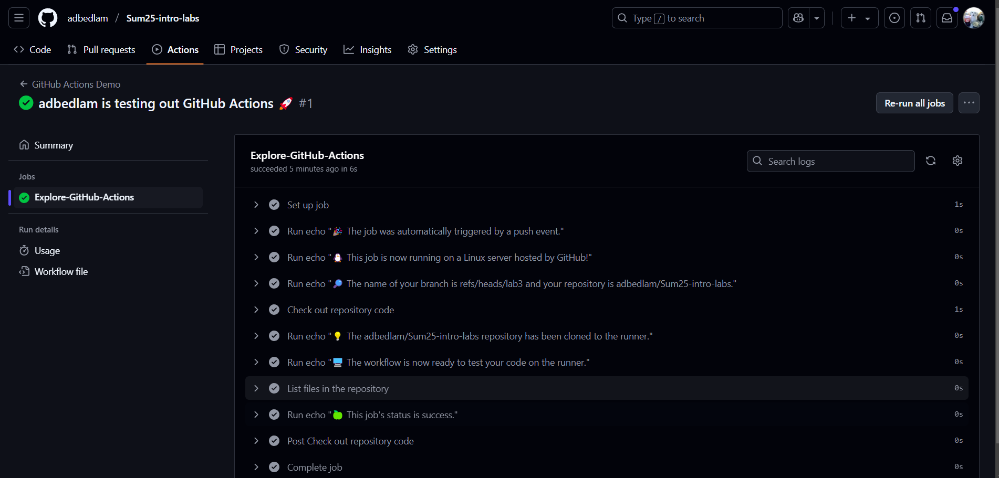

## LAB 3
Nikita Yaneev n.yaneev@innopolis.unversity


### TASK 1.1


#### Key steps

1. Creating yaml file

2. Write in the file 
```name: GitHub Actions Demo
run-name: ${{ github.actor }} is testing out GitHub Actions 🚀
on: [push]
jobs:
  Explore-GitHub-Actions:
    runs-on: ubuntu-latest
    steps:
      - run: echo "🎉 The job was automatically triggered by a ${{ github.event_name }} event."
      - run: echo "🐧 This job is now running on a ${{ runner.os }} server hosted by GitHub!"
      - run: echo "🔎 The name of your branch is ${{ github.ref }} and your repository is ${{ github.repository }}."
      - name: Check out repository code
        uses: actions/checkout@v4
      - run: echo "💡 The ${{ github.repository }} repository has been cloned to the runner."
      - run: echo "🖥️ The workflow is now ready to test your code on the runner."
      - name: List files in the repository
        run: |
          ls ${{ github.workspace }}
      - run: echo "🍏 This job's status is ${{ job.status }}."
```
3. push on the git

#### Key Concepts

- **GitHub Actions**: A CI/CD tool integrated into GitHub that automates workflows like testing, building, and deploying code.
- **Workflow**: Defined in `.github/workflows/` using YAML. It's a set of steps that GitHub executes.
- **Runners**: Virtual machines or containers that run workflows.
- **Triggers**: Events that start workflows (e.g., `push`, `pull_request`).

#### Results



#### TASK 1.2


As a result we can see, changed yaml file, which tell us a information about task 1.2 

### TASK 2.1