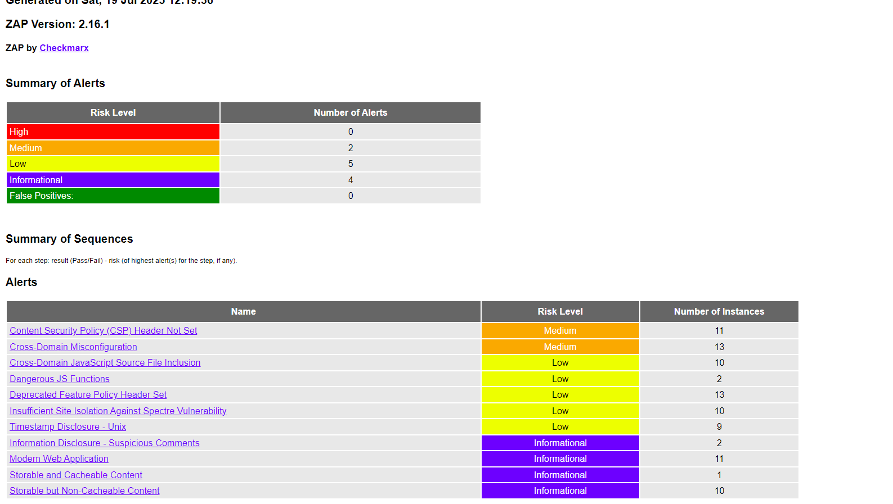

## LAB 9
Nikita Yaneev n.yaneev@innopolis.unversity


## Task 1


```
# zap-baseline rule configuration file
# Change WARN to IGNORE to ignore rule or FAIL to fail if rule matches
# Only the rule identifiers are used - the names are just for info
# You can add your own messages to each rule by appending them after a tab on each line.
10003   WARN    (Vulnerable JS Library (Powered by Retire.js))
10009   WARN    (In Page Banner Information Leak)
10010   WARN    (Cookie No HttpOnly Flag)
10011   WARN    (Cookie Without Secure Flag)
10015   WARN    (Re-examine Cache-control Directives)
10017   WARN    (Cross-Domain JavaScript Source File Inclusion)
10019   WARN    (Content-Type Header Missing)
10020   WARN    (Anti-clickjacking Header)
10021   WARN    (X-Content-Type-Options Header Missing)
10023   WARN    (Information Disclosure - Debug Error Messages)
10024   WARN    (Information Disclosure - Sensitive Information in URL)
10025   WARN    (Information Disclosure - Sensitive Information in HTTP Referrer Header)
10026   WARN    (HTTP Parameter Override)
10027   WARN    (Information Disclosure - Suspicious Comments)
10028   WARN    (Off-site Redirect)
10029   WARN    (Cookie Poisoning)
10030   WARN    (User Controllable Charset)
10031   WARN    (User Controllable HTML Element Attribute (Potential XSS))
10032   WARN    (Viewstate)
10033   WARN    (Directory Browsing)
10034   WARN    (Heartbleed OpenSSL Vulnerability (Indicative))
10035   WARN    (Strict-Transport-Security Header)
"gen.conf" 69L, 3226B 
```


## Task 1 Results
- Juice Shop vulnerabilities found (Medium): 2
- Most interesting vulnerability found: 
Name	Risk Level	Number of Instances
Content Security Policy (CSP) Header Not Set - our application is vulnerable to XSS attacks
- Security headers present: No

## Task 2
## Task 2 Results
- Critical vulnerabilities in Juice Shop image: 25 (17 HIGH, 8 Critical)
- Vulnerable packages: 
   1. base64url
   2. braces
   3. crypto-js
   4. express-jwt
   5. http-cache-semantics
   6. ip
   7. jsonwebtoken
   8. lodash
   9. lodash.set
   10. moment
   11. sanitize-html
   12. vm2
   13.  ws

- Dominant vulnerability type: SVE